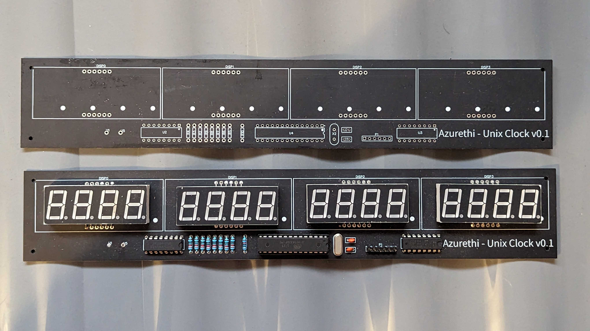

# Unix-clock
A small arduino project to create a unix timestamp clock!

## Main things to see

- [Firmware](https://github.com/Azurethi/Unix-clock/blob/master/firmware/final/final.ino)
- [Circuit Schematic](https://github.com/Azurethi/Unix-clock/blob/master/hardware/V1/Schematic_Unix-clock_V1.pdf)
- [PCB overview](https://github.com/Azurethi/Unix-clock/blob/master/hardware/V1/PCB_Unix-clock_V1_merge.pdf)
- [PCB layers](https://github.com/Azurethi/Unix-clock/tree/master/hardware/V1/PCB_Unix-clock_V1_layers)

## Final build & pcb

Using the smaller 4x8 segment displays I had on hand

